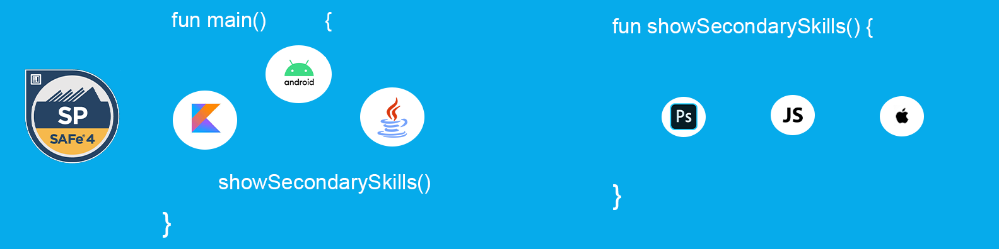

<h1 align="center">Hi 👋, I'm Siju</h1>

&nbsp;
&nbsp;  

  

# 💫 About Me :
- Masters in CS from University of Florida
- Mobile developer
- Ask me about **Android, Kotlin, Java**
- Reach me at **sjdeveloperworks@gmail.com**

## Checkout my app on Playstore
<a href="https://play.google.com/store/apps/details?id=com.siju.acexplorer&hl=en" target="_blank">

</a>

# 💻 Tech Stack
              
# 📊GitHub Stats :
 
 

## 🏆 GitHub Trophies

